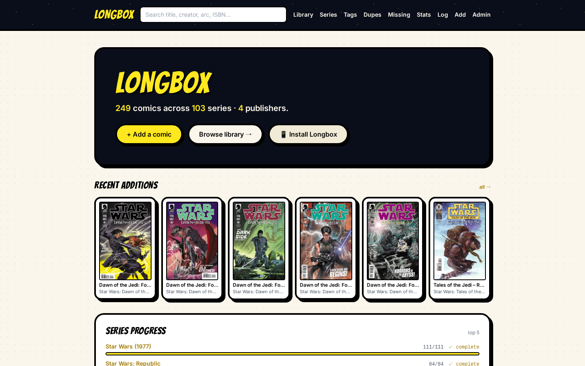
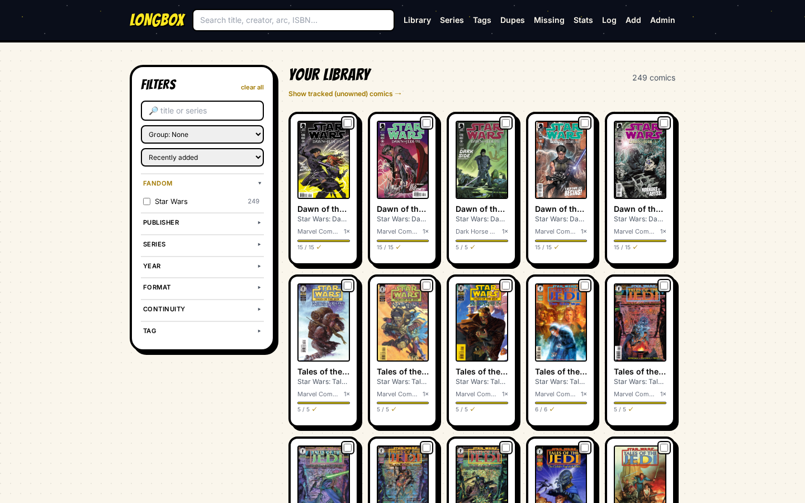
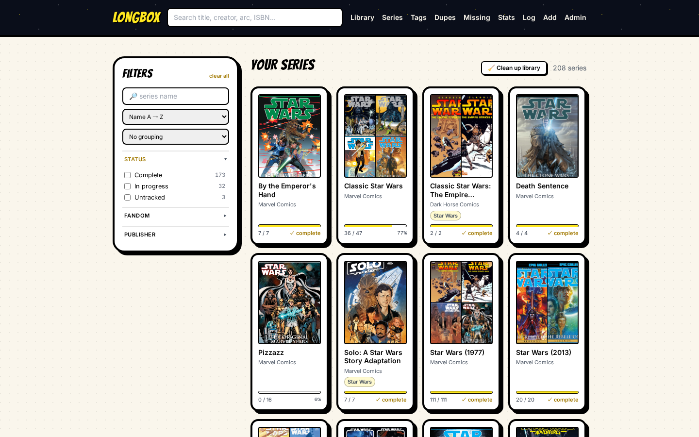
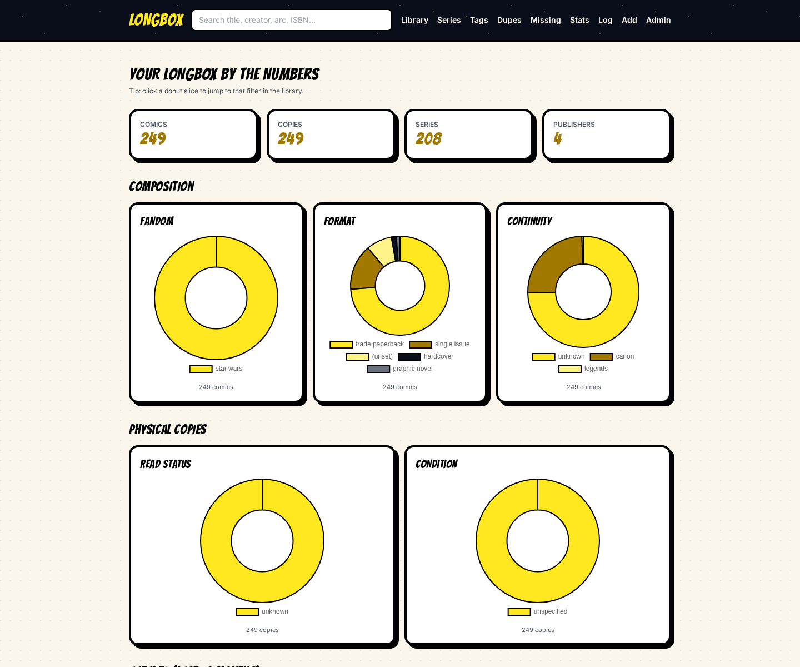
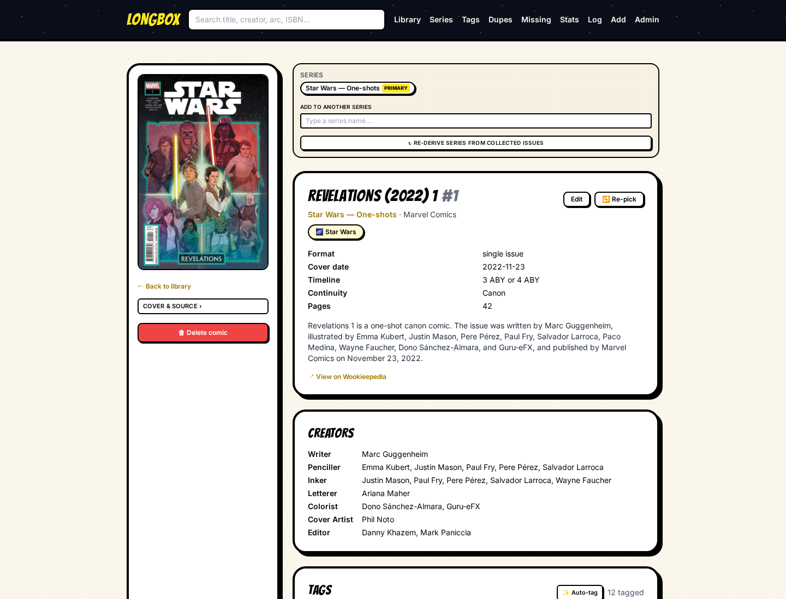
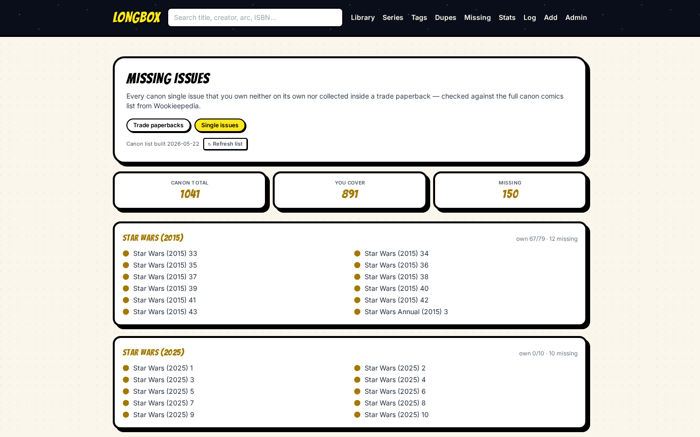
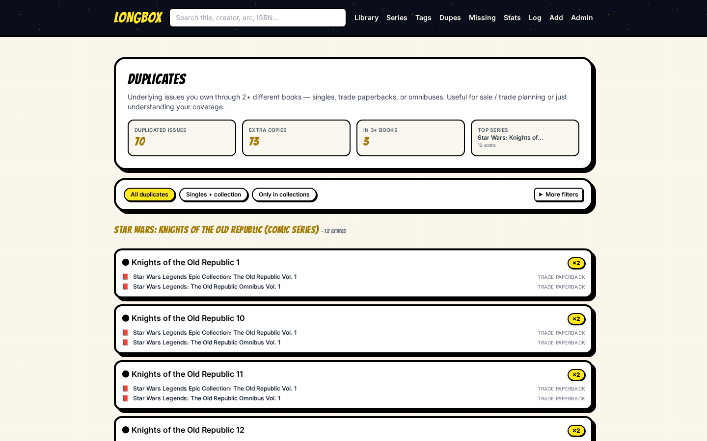
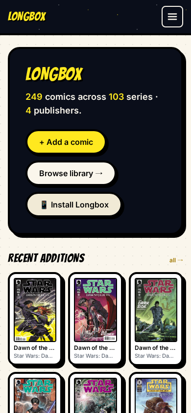
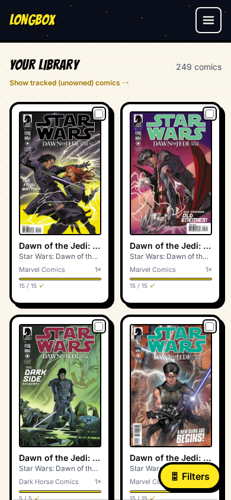
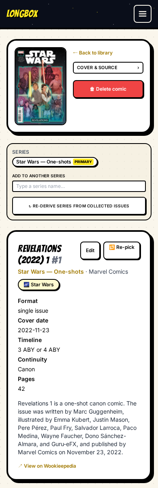

# Longbox

Self-hosted comic library manager. Catalog issues and trades by ISBN, UPC, or
upstream IDs; pull metadata from Wookieepedia, ComicVine, Metron, and Open
Library; track variant covers per copy; browse with filters, stats, and a
comic-book-themed UI. Runs as a single Docker container.

**Stack:** FastAPI · SQLModel + SQLite (aiosqlite) · Alembic · HTMX + Tailwind
(CDN). No Node / JS build step; one Python process.

**Currently:** 484 passing tests, 11 migrations, single-user / LAN-only by
design.



---

## Feature highlights

| Area | What you get |
|---|---|
| **Add** | ISBN / UPC / ComicVine ID / Metron ID lookup. Free-text search across every source in parallel. Per-comic re-pick when the auto-match is wrong. Camera-based barcode scanner. |
| **Variant covers** | When the source exposes a cover gallery (Wookieepedia ships gallery sections on most singles), the add flow surfaces a thumbnail strip of every variant. Pick the one you own; the variant label + cover are stored per-Copy so progress math stays correct. |
| **Library browse** | Card grid with filters: publisher, series, year, fandom, format, continuity, era, tag, story arc, read status, storage. Group by. Bulk edit (storage / format / fandom / canon / era / mark-read / tag add/remove / delete). Stats donut slices link straight to the matching filtered view. |
| **Series view** | `/series` index with collage covers, completion bars, status (complete / in progress / untracked). Series detail page shows progress, owned vs. missing issues, refresh-from-source button, merge UI. Multi-series membership: a comic can belong to N series (omnibus collecting from multiple titles). |
| **Containment** | One Comic can declare it contains other Comics — TPB inside an omnibus, issue inside a TPB. Renders both directions on the detail page (what this contains; what owns this). |
| **Stats** | KPI strip, composition donuts (fandom / format / continuity / era), physical copies donuts (read status / condition / storage), 12-month activity bars (added / read), highlights (oldest, most recent, heaviest add-month, most-tagged). Every donut slice is clickable. |
| **Tags** | Free-form tagging. Tag index at `/tags`. Auto-tagging on add from upstream characters / story arcs. Bulk tag add/remove on `/library`. |
| **CSV import** | Five-step wizard: upload → map columns → choose sources → resolve rows (search + multi-hit picker + custom-query) → commit. Round-trippable CSV template. |
| **Duplicates** | `/duplicates` flags comics owned multiple ways (e.g. the same issue physically AND collected inside an omnibus you also own). Filterable view; one-click jump to the comic. |
| **Missing-issues** | `/missing` aggregates every series's gap list across the whole library, batched into "missing single issues" and "missing TPBs/trades that would close out a series". |
| **Cleanup** | `/admin` runs an inconsistencies sweep that flags suspect data (wrong-pick comics, prose collected_issues, format vs source mismatch, outlier years). One-click jump into per-comic re-pick. Plus a heavy-lifting **Clean up library** action that re-derives series + auto-links + prunes empties for every comic in one pass. |
| **Portability** | Full backup `.zip` (data + covers). JSON-only export. CSV export (one-row-per-copy spreadsheet shape + re-importable wizard shape). Restore endpoint. Factory-reset wipe behind a typed confirmation phrase. |
| **Mobile** | Responsive at 360px. Hamburger nav. Filter bottom-sheet drawer. Fullscreen barcode scanner with corner brackets, torch toggle, haptic feedback. PWA install (web manifest + service worker + offline shell). |
| **Reading log** | Timeline of read copies grouped by month. |

### A few more views

| | |
|---|---|
|  |  |
| `/library` — card grid + filter sidebar | `/series` — collage covers + completion bars |
|  |  |
| `/stats` — composition donuts + KPIs | `/comic/{id}` — full detail page with creators, tags, multi-series links |
|  |  |
| `/missing` — gap report across owned series | `/duplicates` — issues you hold redundantly |

Mobile-responsive throughout:

| Home | Library | Comic detail |
|---|---|---|
|  |  |  |

---

## Deploy

### Portainer / git-pull stack (production)

1. **Stacks → Add stack → Repository**.
2. Repository URL: this repo. Authenticate if private.
3. Compose path: `docker-compose.yml`.
4. Environment variables: paste contents of `.env.example`. Uncomment any
   `COMICVINE_API_KEY` / `METRON_USER` etc. you have. Nothing is required —
   the app degrades gracefully when a source is unconfigured.
5. Deploy.
6. App reachable at `http://<host>:8080/`. Health: `/health` returns JSON
   with the running version.

LAN-only by design. No reverse proxy or TLS in the stack. The named volume
`longbox_data` persists the SQLite DB and downloaded covers across redeploys.

> **Note on the camera scanner:** browsers require a secure context for
> `getUserMedia`. `http://localhost` counts as secure; `http://192.168.x.y`
> does **not**. If you want to scan from another device on your LAN, front
> the container with a reverse proxy that terminates TLS (Caddy / Traefik /
> nginx) and visit via `https://`.

### Local Docker

```bash
cp .env.example .env
docker compose up --build
```

App at `http://localhost:8080/`. SQLite + covers in the named volume.

### Local Python (dev)

Requires Python 3.13 and [uv](https://docs.astral.sh/uv/).

```bash
uv sync
uv run uvicorn app.main:create_app --factory --reload --port 8000
```

`http://localhost:8000/`. Data goes into `./data/` by default (configurable
via `DATA_DIR`).

---

## Run the test suite

A dedicated Docker stage runs every test with all dev deps installed:

```bash
docker build --target test -t longbox-test .
docker run --rm longbox-test
```

No host Python needed. The runtime image is unaffected — `pytest` and the
test files only live in the `test` stage.

For a single test or a quick iteration during development:

```bash
docker run --rm longbox-test pytest -q app/tests/test_pwa.py
```

---

## Configuration (.env keys)

Every key is optional except `DATA_DIR` (defaults to `/data`).

| Key | Default | Purpose |
|---|---|---|
| `APP_ENV` | `production` | Surfaced in logs / banners. |
| `DATA_DIR` | `/data` | SQLite + cover image files live here. The volume mount lands here. |
| `COMICVINE_API_KEY` | unset | Enables the ComicVine source. Free key at comicvine.gamespot.com. |
| `COMICVINE_USER_AGENT` | `Longbox/1.1 (+https://github.com/marinswk/longbox)` | CV requires a non-default UA. |
| `METRON_USER` / `METRON_PASS` | unset | Enables the Metron source. Free account at metron.cloud. |
| `METADATA_CACHE_TTL_DAYS` | `30` | Upstream lookups are cached this long. Lifespan prune deletes older rows on every cold start. |
| `ALLOWED_HOSTS` | `*` | Comma-separated TrustedHostMiddleware allowlist. Tighten when fronted by a reverse proxy. |
| `CSRF_ALLOWED_ORIGINS` | unset | Comma-separated `scheme://host[:port]` allowlist. When set, blocks cross-origin non-GET requests (CSRF guard). Recommended for any deploy beyond localhost. |

Wookieepedia and Open Library need no credentials.

---

## Documentation

User-facing guides for each feature live in [`docs/`](docs/):

- **[docs/quickstart.md](docs/quickstart.md)** — first-run flow, getting your
  first comic in.
- **[docs/adding-comics.md](docs/adding-comics.md)** — ISBN/UPC lookup, ID
  lookup, free-text search, camera scanner, manual entry, variant cover
  picker, re-pick when the auto-match was wrong.
- **[docs/library.md](docs/library.md)** — browsing, filters, sort, bulk
  edit, group by.
- **[docs/series.md](docs/series.md)** — series index, completion tracking,
  refresh from source, merge, multi-series links, canceled-issue handling.
- **[docs/tags-and-fandoms.md](docs/tags-and-fandoms.md)** — manual tags vs.
  auto-tags, fandoms (which differ from tags), tag pages.
- **[docs/import-csv.md](docs/import-csv.md)** — the five-step wizard,
  expected CSV shape, round-trip with the export.
- **[docs/admin.md](docs/admin.md)** — backup / restore / export /
  inconsistencies sweep / orphan prune / cleanup / factory reset.
- **[docs/mobile-and-pwa.md](docs/mobile-and-pwa.md)** — install as an app,
  the barcode scanner, what works offline.
- **[docs/architecture.md](docs/architecture.md)** — high-level layout for
  developers / contributors.
- **[docs/screenshots/](docs/screenshots/)** — UI captures. Drop your own
  screenshots in here; they get referenced from the docs.

---

## Project layout (quick map)

```
app/
  main.py            FastAPI factory + lifespan migrations & backfills
  config.py          pydantic-settings env loader
  db.py              async SQLite session / engine
  models.py          SQLModel tables
  migrations.py      Alembic runner
  version.py         single-source-of-truth semver
  routers/           one file per top-level URL family
  services/          source clients (CV, Metron, Wookieepedia, OL),
                     aggregator, CSV import, repick, wipe,
                     series merge, library cleanup, etc.
  templates/         Jinja2 + HTMX + Tailwind. Inline JS where useful.
  static/            tiny static assets (SVG icons)
  tests/             pytest suite
alembic/             migration files (numbered, 0001 → 0011)
docs/                user + developer guides
Dockerfile           multi-stage: builder → test → runtime
docker-compose.yml   single-container production deploy
ROADMAP.md           living backlog
CLAUDE.md            project context for future AI-pair-coding sessions
CONTRIBUTING.md      how to set up dev, run tests, send PRs
CODE_OF_CONDUCT.md   Contributor Covenant 2.1
SECURITY.md          how to report vulnerabilities
LICENSE              MIT
```

---

## Contributing

See [CONTRIBUTING.md](CONTRIBUTING.md) for development setup, test workflow,
commit conventions, and pre-commit hooks. Participation in this project
is governed by the [Code of Conduct](CODE_OF_CONDUCT.md).

Reporting a security issue: see [SECURITY.md](SECURITY.md).

---

## License

[MIT](LICENSE).
